# Are Domain Generalization Benchmarks with Accuracy on the Line Misspecified?

Domain generalization aims to build machine learning models that perform reliably across diverse, unseen environments. A key challenge arises from **spurious correlations**—features that appear informative during training but fail to generalize due to their instability across different environments. For instance, a model trained to recognize birds might incorrectly rely on backgrounds (e.g., water backgrounds for waterbirds) rather than the bird features themselves, leading to poor generalization when backgrounds change.

We investigate a fundamental issue with domain generalization benchmarks: many widely-used benchmarks may be misspecified, particularly those displaying "accuracy on the line," where better in-distribution (ID) accuracy reliably predicts better out-of-distribution (OOD) accuracy. We argue that this pattern signals that these benchmarks do not effectively test the robustness of models against spurious correlations.

We define a benchmark (an in distribution (ID) and out-of-distribution (OOD) split) as **well-specified** if a model relying exclusively on domain-general features (non-spurious and stable across environments) achieves better out-of-distribution generalization compared to a model exploiting spurious features.

Our simulation and real-world data results can be explore via an interactive app [here](https://misspecified-dg-benchmarks-viz.streamlit.app/).


## Practical Implications

Our findings suggest crucial considerations for the research community:

1. **Benchmark Selection**: Researchers should prioritize benchmarks without accuracy on the line when evaluating domain generalization.

2. **Evaluation Practices**: Averaging results across multiple ID/OOD splits can obscure meaningful insights, especially if only certain splits are well-specified.

3. **Model Selection**: Selecting models based solely on held-out accuracy may unintentionally reinforce reliance on spurious correlations.


Our work highlights the importance of critically re-evaluating and refining benchmarks to ensure they accurately measure robustness to spurious correlations, thereby paving a clearer path toward reliable model generalization under strong distribution shifts, e.g., a pandemic.

## Key Theoretical Insights

**Results 1. Sufficient spurious correlation reversal gives well-specified domain generalization ID/OOD splits.**

Our primary theoretical result (Theorem 1) introduces the concept of a negative margin under distribution shift, also known as **spurious correlation reversal**. Informally, this margin quantifies how drastically the correlation between spurious features and labels must reverse from the training distribution to the testing distribution for the ID/OOD split to be well-specified. We assume spurious features $Z_\text{spu}$ to be either sub-Gaussian with parameter $\kappa$ (we can relax this assumption, e.g., only assume bounded second moments, with only the constant factors adjusted to account for the different concentration properties). Define a shift function $\phi$ such that $\phi$ is $L_\phi$-Lipschitz parameterizes the distribution shift such that $Z_\text{spu}^{OOD} = \phi(Z_\text{spu}^{ID})$, where $\mathbb{E}[Z_\text{spu}^{OOD}] = M\mathbb{E}[Z_\text{spu}^{ID}]$ for $M \in \mathbb{R}^{l\times l}$. Then, given weights learned from spurious features $ w_{spu} $ from training (ID) data, the mean vector of spurious features $ \mu_{spu} $, and covariance matrix $ \Sigma_{spu} $, the benchmark is well-specified with probability at least $1-\delta$ if:

$$w_{spu}^T(M\mu_{spu}) + \sqrt{2(L_\phi \kappa)^2 \Sigma_{spu} \log(1/\delta)} < 0$$

Here, $w_{spu}$ represents how strongly a model relies on spurious features, and $ M $ indicates the mean of the shifted spurious correlations from the training to testing distributions.


**Results 2. Sufficient spurious correlation reversal (i.e., well-specified) and Accuracy on the line are at odds. They simulataneously hold with probability 0.**
**Accuracy on the line** occurs when there's a strong linear correlation between in-distribution and out-of-distribution accuracy across various models:

Mathematically, for classifiers $f$ and distributions $P_{ID},\, P_{OOD}$:

$$|\Phi^{-1}(acc_{P_{ID}}(f)) - a \cdot \Phi^{-1}(acc_{P_{OOD}}(f))| \leq \epsilon \quad \text{for constants } a, \epsilon \in \mathbb{R},\,\epsilon > 0$$

Here, $\Phi^{-1}$ is the inverse Gaussian cumulative density function. A positive $a$ indicates accuracy on the line; negative $a$ indicates accuracy on the inverse line.

Our analysis shows a fundamental trade-off (Theorem 2):
- Define $W_\varepsilon$ as the set of shifts ($\phi$'s) satisfying both the well-specified condition and accuracy on the line simultaneously. Then:

$$W_0 \text{ has Lebesgue measure zero in } \mathbb{R}^{k\times k}, \quad\text{and}\quad W_{\varepsilon_i} \subseteq W_{\varepsilon_j} \quad\text{for } 0 \leq \varepsilon_i \leq \varepsilon_j.$$

Intuitively, as accuracy on the line becomes increasingly perfect ($\varepsilon \to 0$), the probability of encountering a well-specified shift vanishes, meaning benchmarks exhibiting strong accuracy on the line rarely test genuine robustness.
Additionally, the likelihood of observing a well-specified shift increases as the strength of accuracy on the line decreases.

## Empirical Validation
<div style="display: flex; justify-content: center; gap: 100px;">
  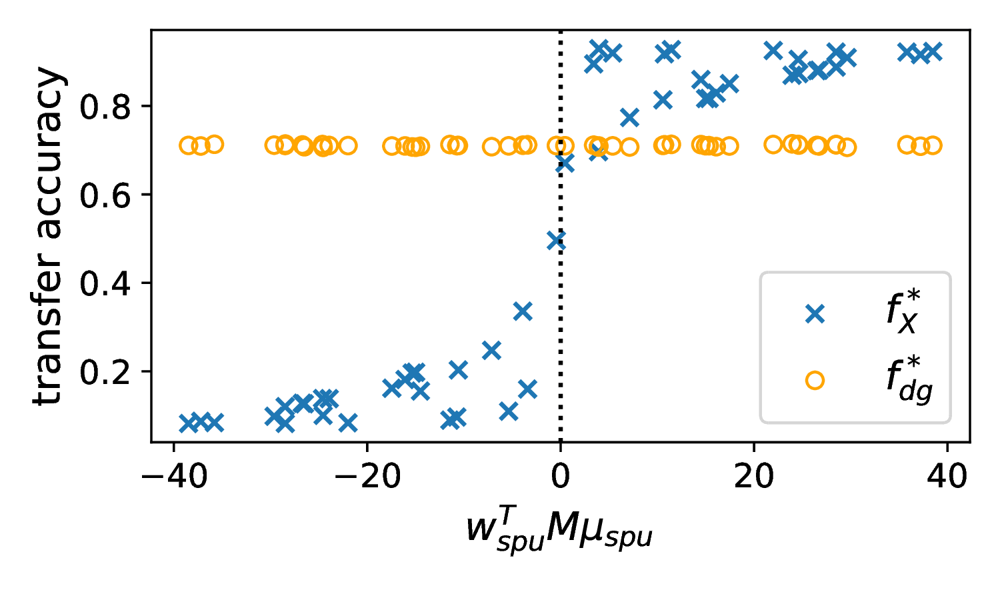
  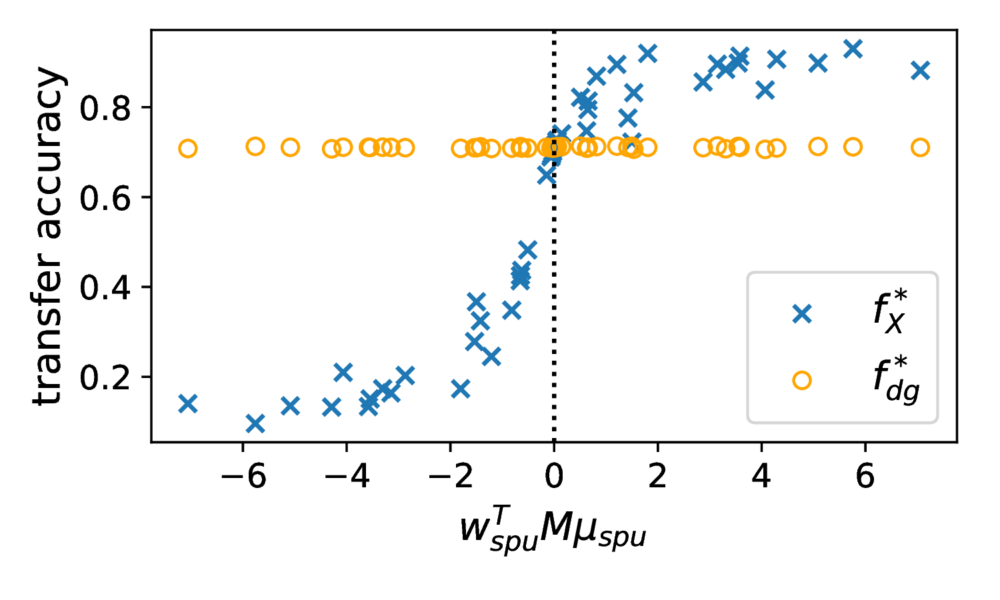
</div>

**Figure 1**: Simulated results for Gaussian Spurious Features (left) and Sub-Gaussian Spurious Features (right), illustrating conditions for well-specified vs. misspecified benchmarks. Generally, without spurious correlation reversa, ($w_{spu}^T(M\mu_{spu}) < 0$), a model that exploits spurious features can achieve higher tranfer (OOD) accuracy than a model that exclusively uses domain general models. $f_{\text{dg}}$ are trained on $(Z_{\text{dg}}, Y)$ pairs and  $f_X$ are trained on $(X, Y)$ pairs from the same distribution. $X=Z_{\text{dg}} \oplus Z_{\text{spu}}^{ID}$, where $\oplus$ is concatenation. $Z_{\text{spu}}^{ID}$ is Sub-Gaussian. We evaluate these models on 50 test distributions generated with randomly sampled $M$ such that all other distributions are the same ID and OOD in the test distribution.

<div style="display: flex; justify-content: center;">
  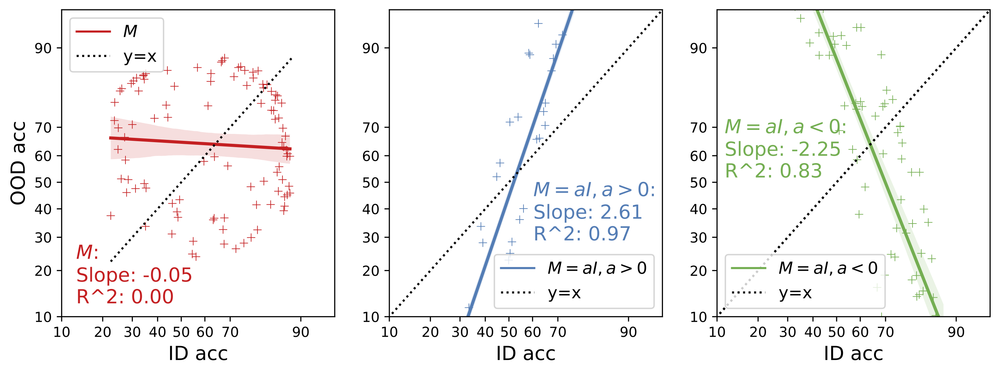
</div>

**Figure 2**. ID vs. OOD accuracy on probit scale. When $M$ satisfies Theorem 1's conditions, the accuracy on the line phenomenon does not occur. For $M_{\text{ID}} = I$ and $M_{\text{OOD}}=aI$, where $a$ is allowed to vary, we observe accuracy on the line. When $a < 0$, we have the spurious correlation reversal condition and have accuracy on the inverse line, where these is a strong but negative correlation between in- and out-of-distribution accuracy. Notably, ID/OOD splits with accuracy on the inverse line are well-specified.

<div style="width:90%; margin:auto;">

<table style="border-collapse: collapse; border: none;">
  <tr>
    <td style="text-align:center; border:none;">
      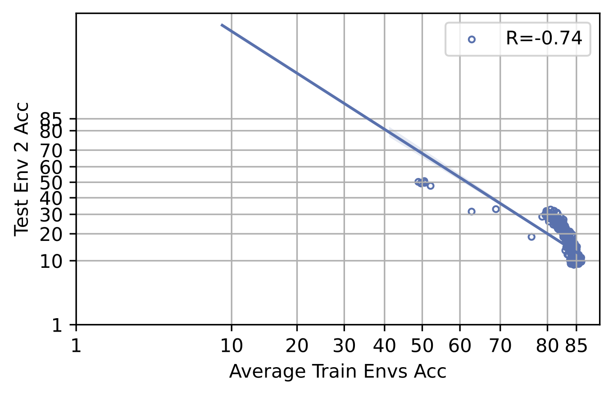<br>
      <strong>3a. ColoredMNIST (Env 2, R=-0.74)</strong>
    </td>
    <td style="text-align:center; border:none;">
      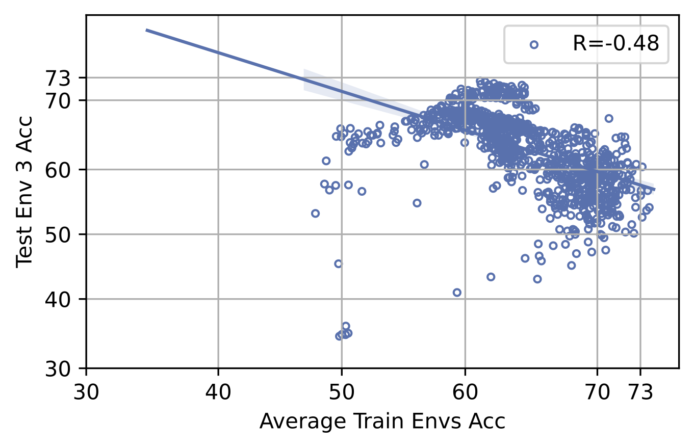
      <br><strong>3b. Covid-CXR (Env 3, R=-0.48)</strong>
    </td>
    <td style="text-align:center; border:none;">
      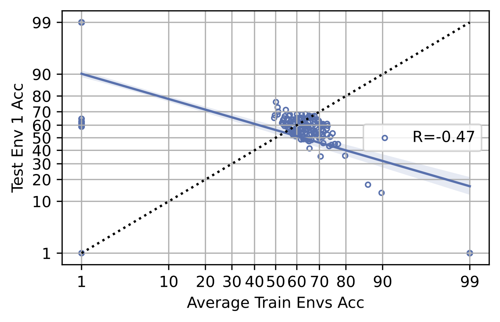
      <br><strong>3c. CivilComments (Env 1, R=-0.47)</strong>
    </td>
  </tr>
  <tr>
    <td style="text-align:center; border:none;">
      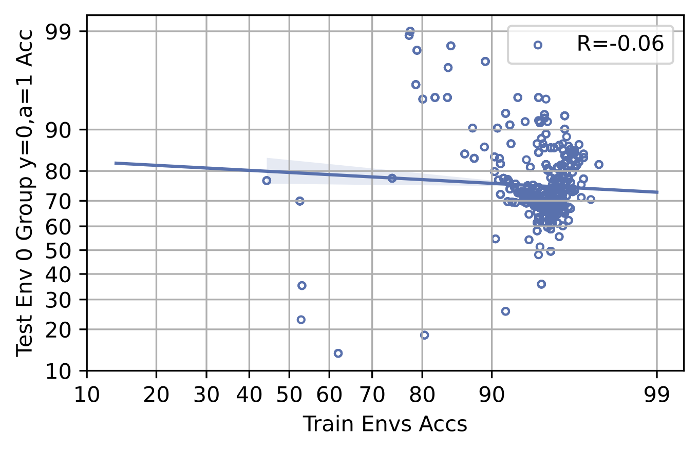
      <br><strong>3d. Waterbirds (Env 0, R=-0.06)</strong>
    </td>
    <td style="text-align:center; border:none;">
      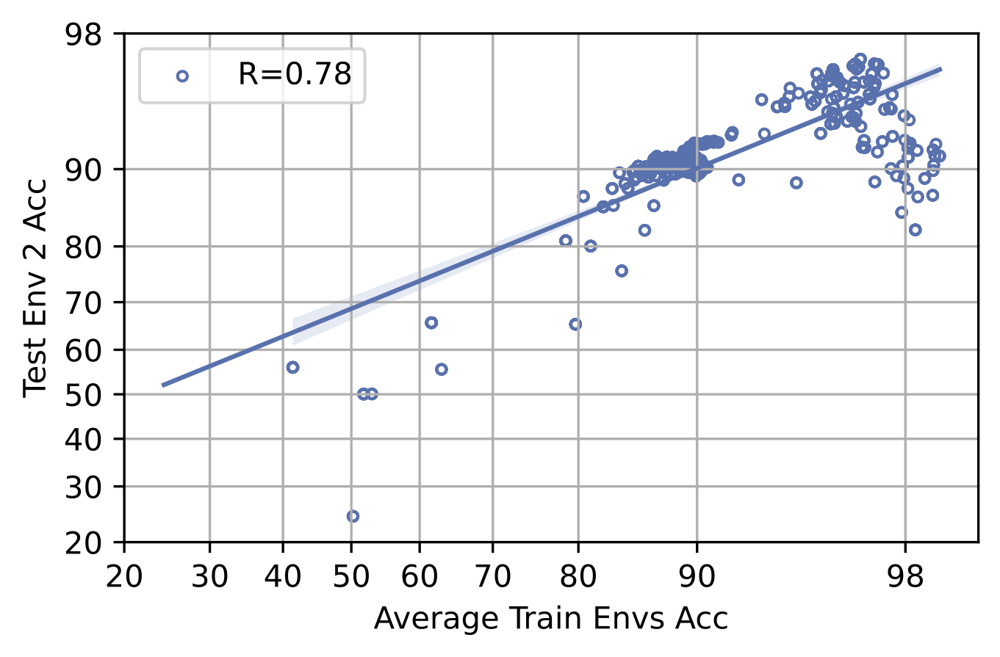
      <br><strong>3e. Camelyon (Env 2, R=0.78)</strong>
    </td>
    <td style="text-align:center; border:none;">
      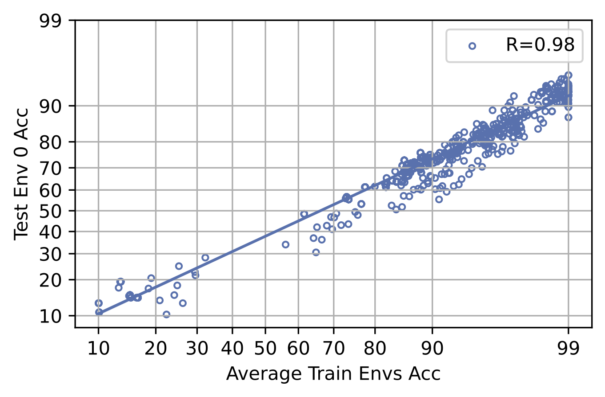
      <br><strong>3f. PACS (Env 0, R=0.98)</strong>
    </td>
  </tr>
</table>
</div>

**Figure 3:** Real-world benchmarks exhibiting varying degrees of accuracy correlation, illustrating well-specified (negative or weak correlation) versus potentially misspecified (strong positive correlation) scenarios. We show some ID/OOD splits of popular domain-generalization benchmarks with a strong positive, weak, or strong negative correlation between in-distribution and out-of-distribution accuracy. Our results suggest that algorithms that consistently provide models with the best transfer accuracies for these splits are at least partially successful in removing spurious correlations.

In Figure 3, we analyze real-world benchmarks, showcasing varying correlation patterns:

- **ColoredMNIST (Fig 3a)**: Strong negative correlation (R=-0.74) when environment 2 is OOD.
- **Covid-CXR (Fig 3b)**: Moderate negative correlation (R=-0.48) when envirionment 3 is OOD.
- **CivilComments (Fig 3c)**: Moderate negative correlation (R=-0.47) when environment 1 is OOD.
- **Waterbirds (Fig 3d)**: Weak negative correlation (R=-0.06) when environment is defined as examples with the pair (y=0, a=1) is OOD.
- **Camelyon (Fig 3e)**: Moderate positive correlation (R=0.78) when environment 2 is the pair.
- **PACS (Fig 3f)**: Strong positive correlation (R=0.98) when environment 0 is the pair.

These empirical examples illustrate how benchmarks vary from well-specified (negative or weak correlations) to potentially misspecified (strong positive correlations). Our analysis indicates that the PACS benchmark, with its strong positive correlation (R=0.98), is likely misspecified for evaluating domain generalization. Camelyon represents an interesting intermediate case: it exhibits strong positive accuracy on the line within a certain accuracy range, but this pattern disappears among higher-accuracy models. This suggests that models primarily rely on spurious correlations after they reach sufficiently high accuracy. Such nuances emphasize the importance of qualitative analyses when selecting ID/OOD splits, as the Camelyon split may still serve as a meaningful benchmark for assessing domain generalization under high-accuracy conditions. Conversely, other benchmarks showing weak or strongly negative correlations, like ColoredMNIST, Covid-CXR, CivilComments, and Waterbirds, clearly satisfy our criteria for well-specified domain generalization benchmarks. The *Waterbirds* benchmark represents a special case of domain generalization known as *subpopulation shift*. In this scenario, we find that the *worst-group accuracy*—the primary metric targeted by methods designed to handle subpopulation shifts—does *not* exhibit accuracy on the line, especially when the worst-performing group is drawn from an out-of-distribution (OOD) environment. This observation highlights the appropriateness of worst-group accuracy as a robust evaluation metric under meaningful distribution shifts.


**Table 1.** Summary of ID/OOD accuracy correlations across multiple benchmarks. Importantly, these correlations are reported at the granularity of individual ID/OOD splits rather than averaged across entire benchmarks or datasets. We emphasize that evaluating performance at this granularity—specific ID/OOD splits—is crucial for effectively assessing domain generalization. For the Camelyon datasets, we find that, qualitatively, these ID/OOD splits may be well-suited for benchmarking domain genaralization, as previously discussed (see Figure 4). More splits can be found in our paper.
<div style="width: 100%; margin: auto; display: flex; justify-content: center;">
<table class="dataframe">
<thead>
<tr>
    <th>OOD</th>
    <th>Slope</th>
    <th>Intercept</th>
    <th>Pearson R</th>
    <th>p-value</th>
    <th>Std. Error</th>
</tr>
</thead>
<tbody>
<tr>
    <td>Spawrious One-to-One Hard: Env 0 acc</td>
    <td>0.32</td>
    <td>-0.21</td>
    <td>0.50</td>
    <td>0.00</td>
    <td>0.05</td>
</tr>
<tr>
    <td>Spawrious Many-to-Many Hard: Env 0 acc</td>
    <td>0.16</td>
    <td>-0.04</td>
    <td>0.29</td>
    <td>0.00</td>
    <td>0.01</td>
</tr>
<tr>
    <td>Covid-CXR: Env 1 acc</td>
    <td>-0.38</td>
    <td>0.13</td>
    <td>-0.50</td>
    <td>0.00</td>
    <td>0.02</td>
</tr>
<tr>
    <td>Covid-CXR: Env 3 acc</td>
    <td>-0.60</td>
    <td>0.56</td>
    <td>-0.48</td>
    <td>0.00</td>
    <td>0.03</td>
</tr>
<tr>
    <td>Covid-CXR: Env 4 acc</td>
    <td>0.53</td>
    <td>-0.04</td>
    <td>0.31</td>
    <td>0.00</td>
    <td>0.04</td>
</tr>
<tr>
    <td>Waterbirds: Env 1 avg acc & Env 0 y=0,a=1 acc</td>
    <td>-0.07</td>
    <td>1.61</td>
    <td>-0.11</td>
    <td>0.00</td>
    <td>0.02</td>
</tr>
<!-- double horizontal line -->
<tr style="border-top: 3px double black;">
    <td>WILDSCamelyon: Env 0 acc</td>
    <td>0.78</td>
    <td>0.33</td>
    <td>0.90</td>
    <td>0.00</td>
    <td>0.01</td>
</tr>
<tr>
    <td>WILDSCamelyon: Env 2 acc</td>
    <td>0.62</td>
    <td>0.49</td>
    <td>0.78</td>
    <td>0.00</td>
    <td>0.01</td>
</tr>
<tr>
    <td>WILDSCamelyon: Env 4 acc</td>
    <td>0.63</td>
    <td>0.40</td>
    <td>0.78</td>
    <td>0.00</td>
    <td>0.01</td>
</tr>
</tbody>
</table>
</div>

<div style="display: flex; justify-content: center; gap: 10px;">
  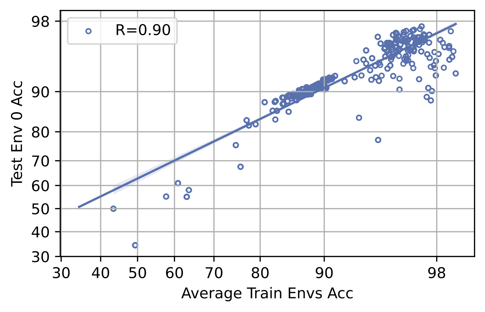
  
  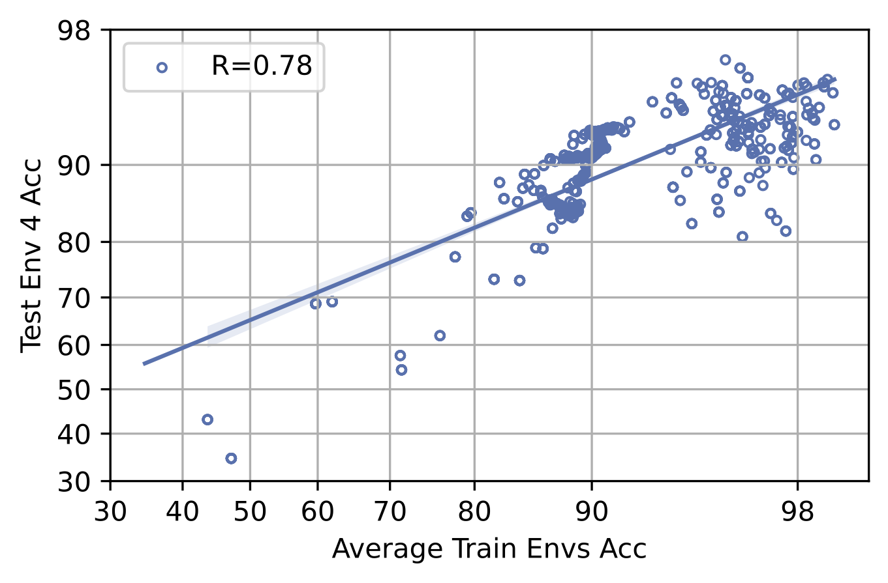
</div>

**Figure 4**: ID/OOD splits for WILDSCamelyon dataset.

## Visualization
./valid_domain_generalization_benchmarks/README.md

```
cd valid_domain_generalization_benchmarks; streamlit run main.py
```

## Reproducing Our Results

Our experiments are conducted using a modification of the [DomainBed](https://github.com/facebookresearch/DomainBed) library. Notably, this our modification includes additional datasets and model architectures than the original domainbed library. The model architectures also include transfer learning and finetuning.

Datasets:
- WILDSCamelyon (Bandi et al., 2018; Koh et al.,2021)
- CivilComments (Borkan et al., 2019; Koh et al., 2021)
- ColoredMNIST (Arjovsky et al., 2019; Gulrajani & Lopez-Paz, 2020a)
- Covid-CXR (Alzate-Grisales et al., 2022; Cohen et al., 2020b; Tabik et al., 2020; Tahir et al., 2021; Suwalska et al., 2023)
- WILDSFMoW (Christie et al., 2018; Koh et al., 2021)
- PACS (Liet al., 2017; Gulrajani & Lopez-Paz, 2020a)
- Spawrious (Lynch et al., 2023)
- TerraIncognita (Beery et al., 2018; Gulrajani & Lopez-Paz, 2020a)
- Waterbirds (Sagawa et al., 2019)

Model Architectures:
- ResNet-18/50 (He et al., 2016)
- DenseNet-121 (Huang et al., 2017)
- Vision Transformers (Dosovitskiy et al., 2020)
- ConvNeXt-Tiny (Liu et al., 2022)


### Results
Our results only include accuracies for the 'out' split of each domain. Our results include two versions:
- x-axis: source domain accuracies individually, y-axis: target domain accuracy individually
- x-axis: average source domain accuracies, y-axis: target domain accuracy individually

### Running the experiments
To run the experiments, use the following command:
```
python sweep.py --datasets <dataset_names> --algorithms <algorithm_names> --n_hparams <n_hparams> --n_trials <n_trials> --model_arch <model_arch>
```

Example:
```
python sweep.py --datasets TerraIncognita --algorithms ERM --n_hparams 25 --n_trials 1 --model_arch vit_b_16
```

